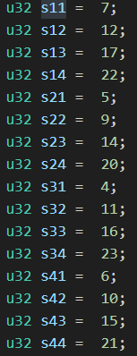
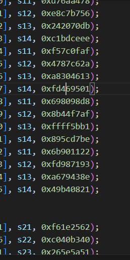

# MD5

## 整体梳理
### 填充
精髓为 “N * 512 + 448 + 64”，N 为非负数，448 为剩余数据填充 1 和无数 0，64 为填充前数据的长度
### 压缩
以 64bit 为一个 block 进行压缩运算，结果存储在 state 中，state 同时会参与下一轮的压缩运算

## 特点梳理
### 特点一
state 初始化一般为
```c++
state[0] = 0x67452301;  // 1732584193
state[1] = 0xefcdab89;  // 4023233417
state[2] = 0x98badcfe;  // 2562383102
state[3] = 0x10325476;  // 271733878
```
### 特点二
固定的 T 表和循环左移顺序（在 transform 函数中）


### 特点三
压缩时，可以看作特征的运算
```c++
(b & c) | ((~b) & d)

(b & d) | (c & (~d))

(b ^ c ^ d)

(c ^ (b | ~d))

shift_left(a + F(b, c, d) + x + Ti, s) + b
```