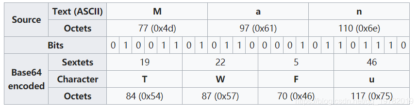

# base64
## 整体梳理

这张图是最好的说明，byte 这种表现形式可以看成“中转形式”，将四个字符的 ASCII 转化成 4 * 8 bit 的 byte 的中间形式，再重新划分为 6 * 4 base64。

## 特点总结
### 特点一
base 表：无论是否魔改一定会有一张类似这样的表
```c
static const char en_table[] = {
    'A', 'B', 'C', 'D', 'E', 'F', 'G', 'H',
	'I', 'J', 'K', 'L', 'M', 'N', 'O', 'P',
	'Q', 'R', 'S', 'T', 'U', 'V', 'W', 'X',
	'Y', 'Z', 'a', 'b', 'c', 'd', 'e', 'f',
	'g', 'h', 'i', 'j', 'k', 'l', 'm', 'n',
	'o', 'p', 'q', 'r', 's', 't', 'u', 'v',
	'w', 'x', 'y', 'z', '0', '1', '2', '3',
	'4', '5', '6', '7', '8', '9', '+', '/',
};
```

### 特点二
运算：为了将字节重新分块一定会包含一些有规律的位移、掩码（&）和组合（|）操作。
```c
out[j++] = en_table[((last & 0x3) << 4) | ((c >> 4) & 0xf)];
```